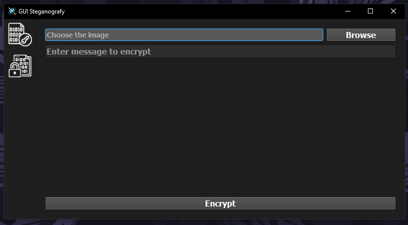
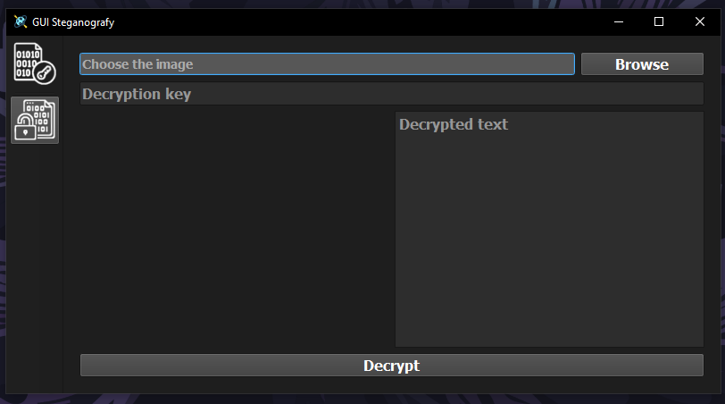
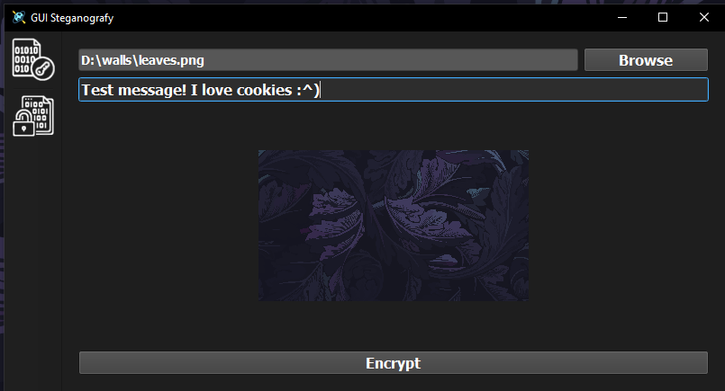
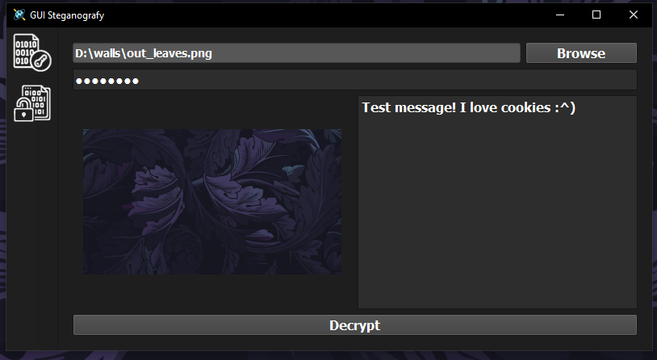
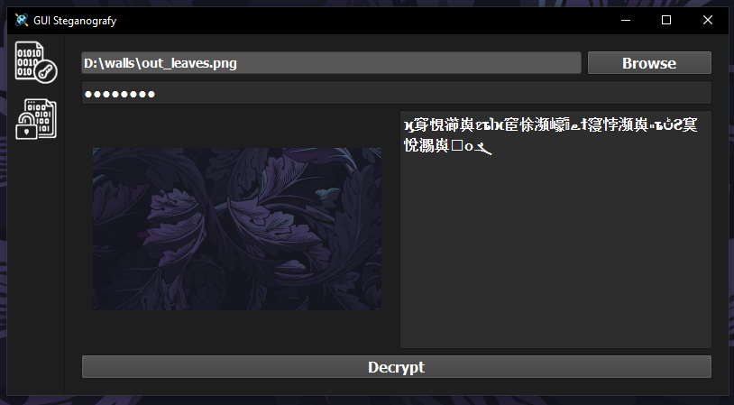
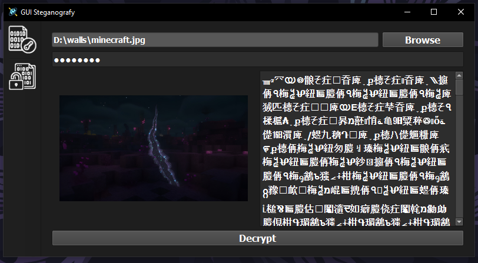

# Steganography-GUI

## Project Overview

This project was started as a console application as part of a university course project, which was then reworked into a GUI application with PyQt6 library and a structured MVC (Model-View-Controller) architecture in mind.

> Steganography is a method of transmitting or storing information while maintaining the secrecy of the fact of such transmission.

This application gives you an ability to encode (decode) your text messages within (from) images (supported formats: PNG, JPG and JPEG).

## Installation Instructions

### Prerequisites

- Python (version 3.6 or higher)
- PIP
- Git (cloning the repository)

### Setup Steps

1. **Clone the repository** (if not already done):

```bash
git clone https://github.com/GitQuasar/Steganography-GUI.git
cd Steganography-GUI
```

2. **Create and enter (exit) a new virtual environment**:

```bash
# Create
python -m venv .venv
# Activate
## On Windows (Powershell):
.\.venv\Scripts\activate
## On macOS/Linux:
source .venv/bin/activate
# To deactivate the virtual environment when done
deactivate
```

3. **Install dependencies**:

```bash
# Install required dependencies from requirements.txt
pip install -r requirements.txt
# Verify installation
pip list
```

## How to Run

Use this command in project root:

```bash
python app.py
```

## Usage examples

### Encryption window as enter screen.



### Decryption window as secondary screen.



### Give it a try and encode some text within an image. Key generates automatically.



### What you will see if you entered the right key while decoding.



### What you will see if you entered the wrong key or used wrong image while decoding.



